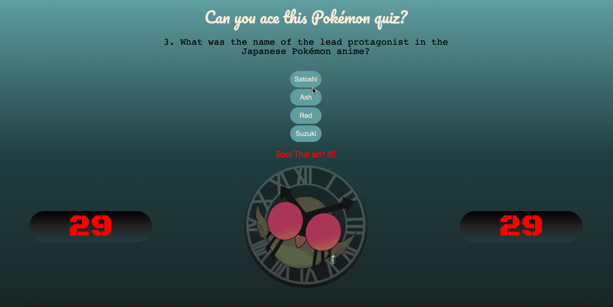

# Quiz-Time: A Quiz About Pokémon!

## Description

I've made a 5-question quiz about Pokémon for people to answer through and attempt to get a high score.

If they answer incorrectly, time is deducted, so essentially their time remaining will be their score.

At the end, a Leaderboard page will display, asking the user to enter their nickname or initials to include their score on the leaderboard, which will then display their score ranked amongst previous player scores.

I was movivated to do this, because it was a great exercise in utilizing JavaScript and furthering it to access the DOM. Beyond that, learning to create more dynamic functions within the DOM allowed me to delve into utilizing local storage to retain previous data and add onto it. This will be undoubtedly helpful in other facets of building applications.

The local storage aspect solves the issue of saved data being lost once the page refreshes.
Also, the clear button solves the issue of saved data being too long.

I learned that scope and placement matters very much. I already knew this, but learned more specifically in every little instance of trying to get something to work properly. Sometimes code can be broken even if you have the correct codes written in, but one line happens to be above or below where it should ideally be, and it can make the biggest difference. I also learned a lot about localStorage in how getItem and setItem relate to each other and why we would need to getItem before setting it in terms of the data types they pull (strings vs arrays vs objects).

## Installation

n/a

## Usage

Upon landing on quiz page, user will be presented with quiz instructions and a start button (the Pokemon circle at the bottom).
User just needs to click the start button to begin.

Then, user can hover over the answer of their choice; the choice they hover over will glow to help indicate that's what they are clicking.
Once user clicks, it will lead to the next question.

Depending on choice, user will receive a message declaring they were correct or incorrect.
Correct answers reward user plus one second (for a maximum total score of 60),
and incorrect answers penalize user with a 10-second deduction.

Once the time is up or the user has answered all five questions, the quiz will finish, display a game over message, and the leaderboards page will load up, allowing for user to input their name, which will display among prior entries in a list below. 

If user does not enter a name or initials in the input box, they will be prompted to and cannot move on until it is done.

The leaderboard is ranked from highest score to lowest.

After submitting entry, user can restart the game or even wipe the leaderboard list at the click of a button.

## Credits

TA - Meg M.: helped with code to rank scores in leaderboard from highest score to lowest

Learning Assistant Mia D.: helped with creating getItem and setItem process

Learning Assistant Alex B.: helped with background gradient and using :root

W3Schools: [Clearing Local Storage](https://www.w3schools.com/jsref/met_storage_clear.asp)